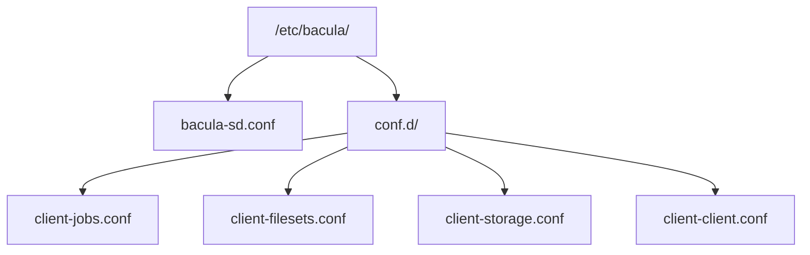
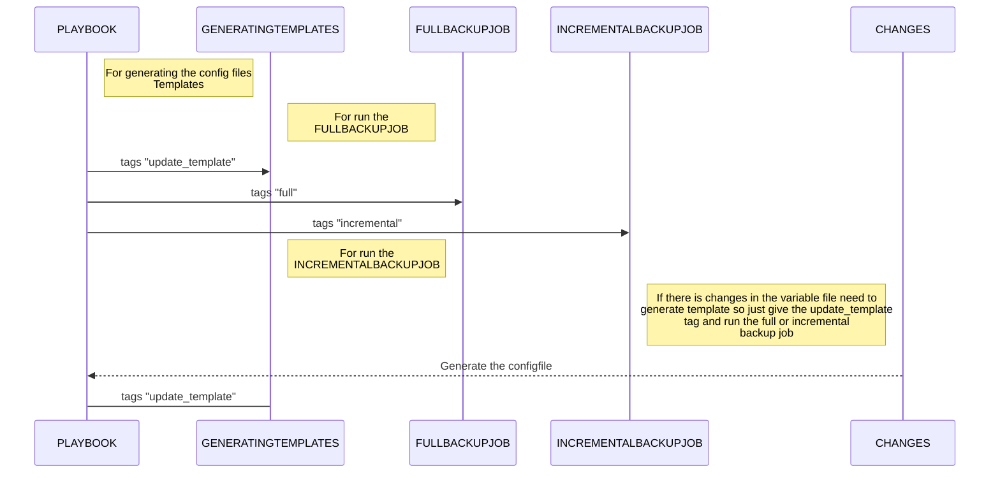

# Bacula-Client

This ansible role is used for setup the client on the client-server and connect to the bacula-server console. <br />
And installing the following two services

1. bacula-fd
2. bacula-console

It also generate the bconsole.conf and bacula-fd.conf files and put into the following locations

1. /etc/bacula/bacula-fd.conf
2. /etc/bacula/bconsole.conf

### Installing the bacula-client 

##### Firstly clone the gitlab repo by following commad - 

``` bash
git clone https://gitlabiptor.iptor.com/iptor-com-cloud/iptor-platform.git

```
##### Go to the repo directory - 

``` bash
cd iptor-platform/

```

There are predefine parameter like **director_name** and **passwords** they dont need to change for same bacula server

##### Run the ansible playbook - 

``` bash
ansible-playbook ansible/bacula-client.yaml

```
This commnd installs the required services and packages and estabished the connection between the client and server


#### Get the Bacula console
```
bconsole

```

#### After getting console there are some following bconsole commands
if you get the __*__ this means that you are in the bacula console


:bulb: Get the status of Director that include all the schedule, runnng and completed job with their status
```
*status dir

```
<br />

:bulb: Get the recent messages
```
*messages

```
<br />

:bulb: Get the Client status
```
*status client

```
and choose the client

<br />
<br />
<br />

# Bacula-Server

> :warning: **Before setup the server you need the setup the client and the and bacula server**

<br />

### clone the iptor-platform repo - 

``` bash
git clone https://gitlabiptor.iptor.com/iptor-com-cloud/iptor-platform.git

```
##### Go to the repo directory - 

``` bash
cd iptor-platform/

```


### This ansible role is ued for configure of the clients on the bacula server 
##### And build the backup, restore jobs and nessary configuration resources like defining
1. Backup Job
2. Restore Job
3. FileSet
4. Device
5. Client
6. Schedule

#### This role creating the configuration file in the following manner


<br />

##### For Set the Clients Need to go to the default variable file

```
vi ansible/roles/bacula-server-configuration/defaults/main.yaml

```
#### **[default/main.yaml](https://gitlabiptor.iptor.com/iptor-com-cloud/iptor-platform/-/blob/master/ansible/roles/bacula-server-configuration/defaults/main.yml)**


``` yaml
---
BACULA_DIRECTOR_PASSWORD: wDCEb9GDq2-5y6f4IcdjOuvS-d54pH5Xk
BACULA_SERVER_ADDRESS: 10.204.68.11
MEDIA_TYPE: TS-3100

BACULA_CLIENTS:
  cpanel02:
    name: cpanel02
    bacula_client: ipt-fr-cpanel-02-fd
    bacula_client_server_name: cpanel02
    bacula_fd_port: 9102
    backup_client_name: CPANEL02
    client_address: 10.204.68.15
    filset_include_dir: "/etc /home /var/ /opt /root /usr /media /mnt"
    filset_exclude_dir: "/var/lib/docker /var/lib/bacula /var/tmp"
    iqdn: iqn.2006-06.com.quadstor.vtl.Cpanel.drive2
    full_backup_schedule: "Full mon-sat at 02:30"
    incremental_backup_schedule: "Incremental mon-sat at 02:30"
    backup_forcefully: false
  smtp03:
    name: SMTP03
    bacula_client: smtp03.iptor.cloud-fd
    bacula_client_server_name: smtp03
    bacula_fd_port: 9102
    backup_client_name: SMTP03
    client_address: 10.206.4.29
    filset_include_dir: "/etc /home /var/ /opt /root /usr /media /mnt"
    filset_exclude_dir: "/var/lib/docker /var/lib/bacula /var/data/kafka"
    iqdn: iqn.2006-06.com.quadstor.vtl.smtp.drive1
    full_backup_schedule: "Full mon-sat at 02:35"
    incremental_backup_schedule: "Incremental mon-sat at 02:35"
    backup_forcefully: false

```

> :point_right: **there are some default parameter that are common for all the clients**

## Full Backup
##### For generating the template for all the customers that are present in the deafult variable file you only need to pass the tag `update_template` that is given in the example and well 
``` bash
cd iptor-platform/
ansible-playbook ansible/bacula-server-configuration.yaml --tags "update_template"

```
##### For Backup the Client for any client you need the set the `backup_forcefully: true` for specific customer in [default/main.yaml](https://gitlabiptor.iptor.com/iptor-com-cloud/iptor-platform/-/blob/master/ansible/roles/bacula-server-configuration/defaults/main.yml#L19) file and run the playbook with the tag `full`
``` bash
ansible-playbook ansible/bacula-server-configuration.yaml --tags "full"
```
##### If you change the any prameter in the default file you need to give the both the tags `"full,update_template"` and it will generate the all templates and run the `FullBackupJob` for the client which has the prameter `backup_forcefully: true` in the [default/main.yaml](https://gitlabiptor.iptor.com/iptor-com-cloud/iptor-platform/-/blob/master/ansible/roles/bacula-server-configuration/defaults/main.yml#L19)

``` bash
ansible-playbook ansible/bacula-server-configuration.yaml --tags "full,update_template"
```
## Incremental Backup
#### Take Incremental backup for client that has the parameter `backup_forcefully: true`
``` bash
ansible-playbook ansible/bacula-server-configuration.yaml --tags "incremental"
```

### This Diagrmm may help you to give tags for run backup jobs


<br />
<br />
<br />
<br />

# bacula-restore

#### Firstly clone the gitlab repo by following commad - 

``` bash
git clone https://gitlabiptor.iptor.com/iptor-com-cloud/iptor-platform.git

```
#### Go to the repo directory - 

``` bash
cd iptor-platform/

```
> For restore the backup you need to change the`bacula_client` , `bacula_client_name` and the `job_id` variables

<br />

the following parameter are present in the default varaible file 
##### **[default/main.yaml](https://gitlabiptor.iptor.com/iptor-com-cloud/iptor-platform/-/blob/master/ansible/roles/bacula-restore/defaults/main.yaml)**
``` yaml
---
bacula_client: ipt-fr-cpanel-01-fd
bacula_client_name: CPANEL01
restore_client: ipt-fr-cpanel-01-fd
jobid: 1441

```

#### To get the job id run the following command in bconsole - 
```
list jobs
```

> The above command will print the list of the all the Backup And Restore jobs
>
>:warning: Select the job id which done the backup job of same client don't choose the another client's job
>
Copy the `job_id` which currespond to the `client_name` and Type `Backup` 

If you want to restore job for the another client just change the parameter `restore_client` value to the client that you need to restore and run the folloowing commands with tag `restore_another`

``` bash
cd ansible
ansible-playbook bacula-restore.yaml --tags 'restore_another'

```

<br />

#### After that simply run the ansible playbook as follows - 

``` bash
ansible-playbook bacula-restore.yaml --tags 'restore' 

```


After successfully run the playbook it will generate the logs in the following locations
```
tail -f /var/log/bacula/bacula_client-restore-log.out
```
And as well in bacula console
```
bconsole

messages
```
## Setup - NFS

For setup the nfs server firstly clone the repo

``` bash
git clone https://gitlab.int.iptor.com/iptor-cloud/iptor-platform

```
and change to that ansible directory

``` bash
cd iptor-platform/ansible
```


And if you want to setup the nfs to the remote change the Host in the playbook [setup-nfs.yaml](https://gitlab.int.iptor.com/iptor-cloud/iptor-platform/-/blob/master/ansible/setup-nfs.yaml#L1)
change from `localhost` to your IP `10.0.0.0`

``` yaml

- hosts: localhost
  become: true
  roles:
    - { role: setup-nfs }

```
For change the export directory give the export directory and give the parameter for type of nfs in [default/main.yaml](https://gitlab.int.iptor.com/iptor-cloud/iptor-platform/-/blob/master/ansible/roles/setup-nfs/defaults/main.yaml#L2) and you can change the export directory via `"/mnt/nfs_shares *(rw,sync,no_root_squash,insecure)"` to your any directory `"/folder *(rw,sync,no_root_squash,insecure)"`

``` yaml
nfs_exports: [ "/mnt/nfs_shares *(rw,sync,no_root_squash,insecure)" ]
```

And run the ansible-playbook

``` bash
ansible-playbook setup-nfs.yaml
```

